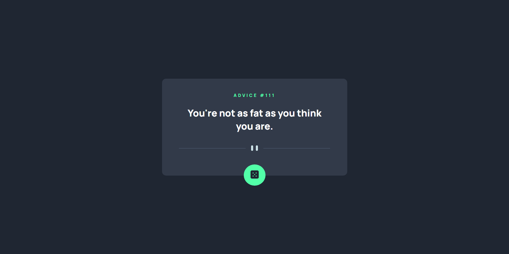
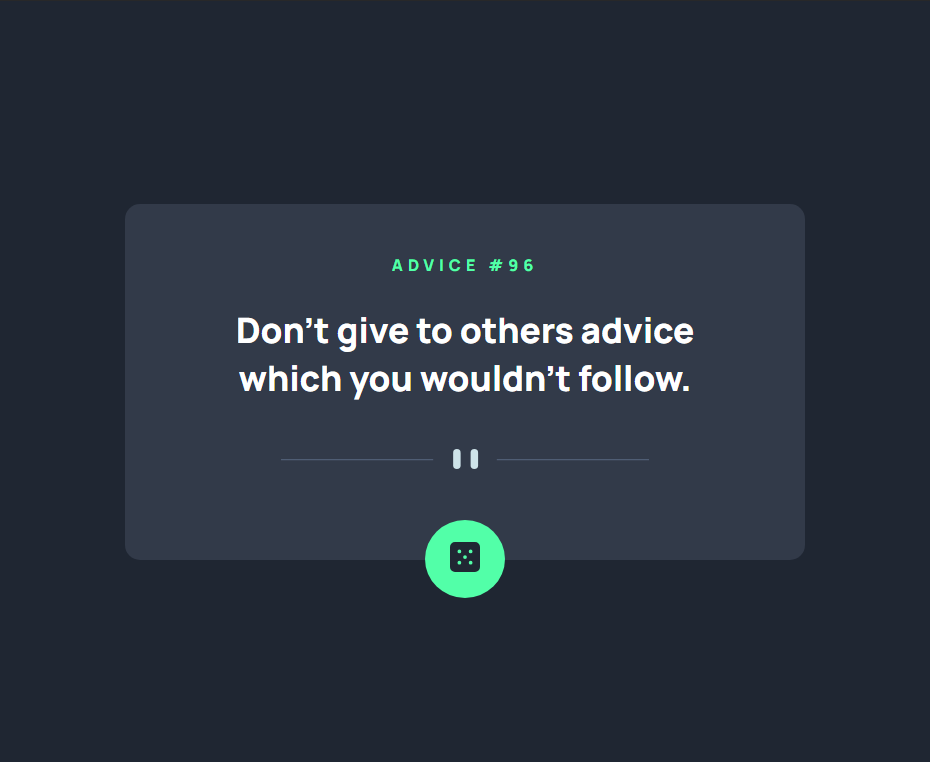

# Frontend Mentor - Advice generator app

This is a solution to the [Advice generator app challenge on Frontend Mentor](https://www.frontendmentor.io/challenges/advice-generator-app-QdUG-13db).

## Table of contents

-   [Overview](#overview)
    -   [Screenshot](#screenshot)
    -   [Links](#links)
-   [My process](#my-process)
    -   [Built with](#built-with)
-   [Author](#author)

## Overview

### Desktop :

## Mobile :

### Links

-   Live Site URL: [Live Server](https://plmohamed.github.io/Advice-Generator/)

## My process

### Built with

-   Semantic HTML5 markup
-   CSS custom properties
-   Flexbox
-   Javascript
-   React

## Author

-   Frontend Mentor - [@PLMohamed](https://www.frontendmentor.io/profile/PLMohamed)
-   Instagram - [@Mohamed_Boumedine](https://www.instagram.com/mohamed_boumedine/)
